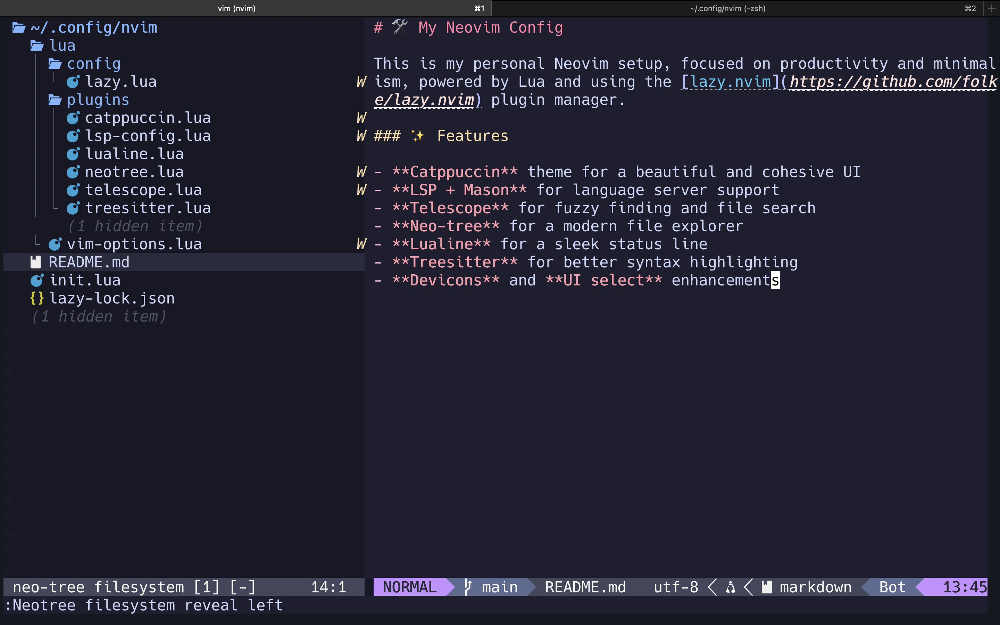
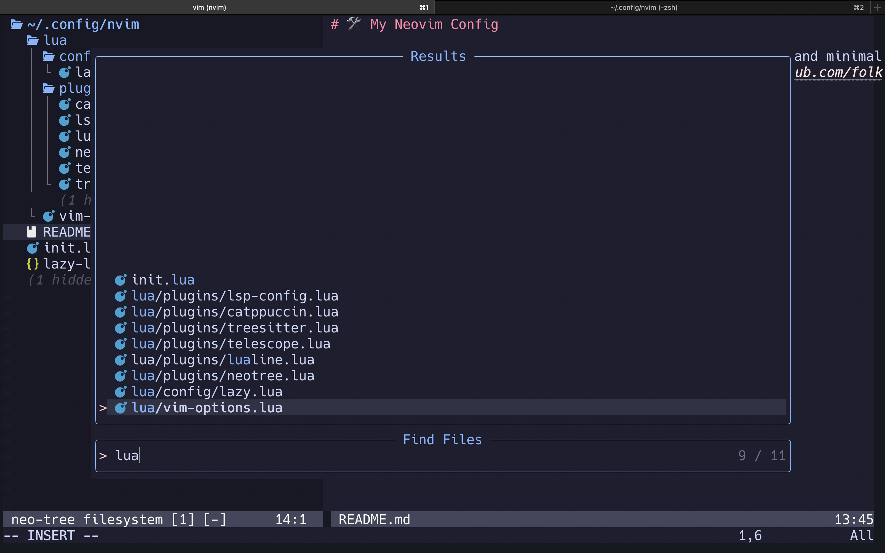
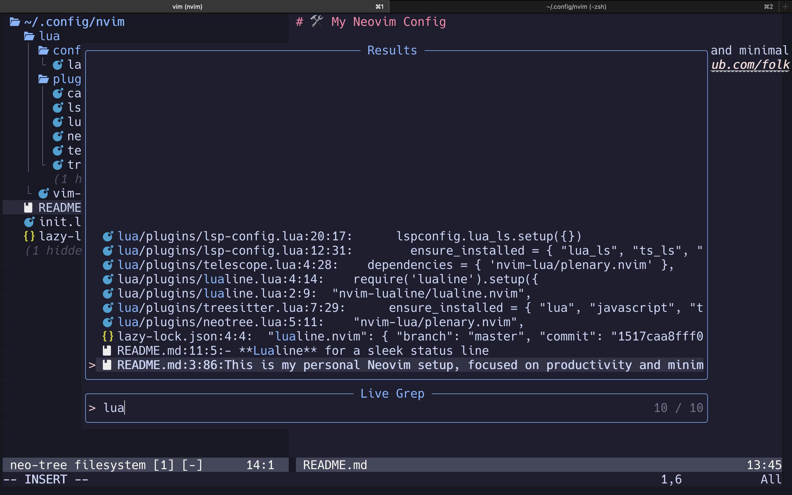

# 🛠️ My Neovim Config

I'm using this on my Arch (Hyprland) install and on my MacOS.

This is my personal Neovim setup, focused on productivity and minimalism, powered by Lua and using the [lazy.nvim](https://github.com/folke/lazy.nvim) plugin manager.

### ✨ Features

- **Catppuccin** theme for a beautiful and cohesive UI
- **LSP + Mason** for language server support
- **Telescope** for fuzzy finding and file search
- **Neo-tree** for a modern file explorer
- **Lualine** for a sleek status line
- **Treesitter** for better syntax highlighting
- **None-ls** for formatting and linting
- **Devicons** and **UI select** enhancements

### 📸 Screenshots

Here’s a quick preview of the setup in action:

#### File View

#### File Search (Telescope)

#### Fuzzy Search

